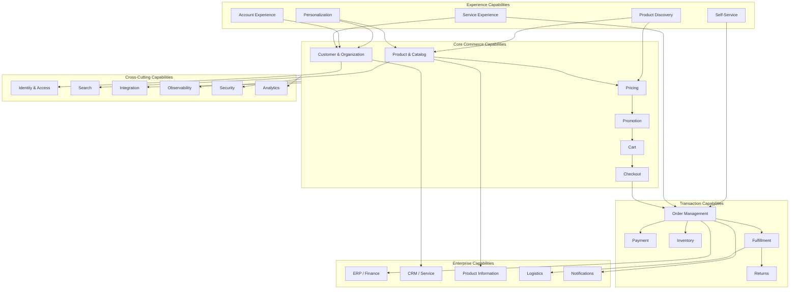

# Enterprise Commerce Capability Map

## Purpose

A capability map describes **what the commerce platform must be able to do**, independent of how those capabilities are implemented.

This helps separate business capabilities from technical components and provides a useful starting point for architecture, modernization, platform evaluation, and ownership discussions.

---

## Capability Map



---

## Capability Groups

### Experience Capabilities

These capabilities shape how customers interact with commerce.

Examples:

- product discovery
- search
- personalization
- account management
- self-service
- service experiences
- channel-specific journeys

The experience layer should consume commerce capabilities rather than independently recreating them.

---

### Core Commerce Capabilities

These capabilities represent the commercial core.

#### Product & Catalog

Responsible for:

- product identity
- variants
- categories
- catalog structures
- product relationships
- merchandising context

#### Customer & Organization

Responsible for:

- customer identity
- accounts
- organizations
- roles
- permissions
- business relationships

#### Pricing

Responsible for:

- price determination
- price lists
- quantity pricing
- market and currency context
- contractual pricing

#### Promotion

Responsible for:

- eligibility
- promotional benefits
- coupons
- stacking rules
- promotional lifecycle

#### Cart

Responsible for:

- shopping intent
- items
- quantities
- cart state
- calculated totals

#### Checkout

Responsible for coordinating:

- customer context
- delivery
- payment
- pricing validation
- inventory validation
- order creation

---

## Transaction Capabilities

### Order Management

The order represents the durable commercial transaction.

Responsibilities include:

- order creation
- order state
- order history
- order modifications
- order events

### Payment

Responsible for:

- authorization
- capture
- refunds
- payment state
- reconciliation

### Inventory

Responsible for:

- stock visibility
- availability
- reservation
- location context
- inventory synchronization

### Fulfillment

Responsible for:

- allocation
- shipment planning
- delivery execution
- partial fulfillment
- fulfillment status

### Returns

Responsible for:

- return eligibility
- return requests
- refund coordination
- exchange flows
- disposition

---

## Cross-Cutting Capabilities

These capabilities support multiple business domains.

| Capability | Purpose |
|---|---|
| Identity & Access | Authentication, authorization and contextual access |
| Search | Discovery and retrieval |
| Integration | Communication with external systems |
| Observability | Operational and business visibility |
| Security | Protection of data, APIs and operations |
| Analytics | Measurement and decision support |

Cross-cutting does not mean ownership should be unclear. Each capability should still have defined responsibilities.

---

## Capability vs Component

A capability answers:

> **What business capability exists?**

A component answers:

> **How is that capability implemented?**

For example:

```text
Capability
    ↓
Pricing

Possible implementation
    ↓
Pricing service
Pricing engine
Commerce module
External pricing platform
Hybrid model
```

The capability should remain stable even if the implementation changes.

---

## Capability Ownership

A useful ownership model is:

```text
Capability
    ↓
Business responsibility
    ↓
Authoritative state
    ↓
Business rules
    ↓
Technical implementation
```

Ownership should be explicit enough to answer:

- Who owns this data?
- Who owns the business rule?
- Who can change it?
- Which system is authoritative?
- How do other systems consume it?

---

## Capability Dependencies

Capabilities should depend on explicit contracts rather than implementation details.

For example:

```text
Checkout
   │
   ├── Pricing
   ├── Promotion
   ├── Inventory
   ├── Customer
   └── Payment
```

This does not mean every dependency must be synchronous.

The architecture should determine whether each interaction requires:

- real-time response
- eventual consistency
- event notification
- asynchronous processing

---

## Using the Capability Map

The map can support:

### Architecture

Identify boundaries and dependencies before selecting technologies.

### Modernization

Determine which capabilities should be:

- retained
- refactored
- replatformed
- replaced
- extracted

### Team Ownership

Align teams around business capabilities rather than arbitrary technical layers.

### Platform Evaluation

Compare platforms based on capability coverage rather than feature checklists alone.

### Technical Debt

Identify capabilities where excessive customization or coupling has created architectural risk.

---

## Architectural Principle

> **Capabilities should remain stable while implementations are allowed to evolve.**

This separation makes enterprise commerce platforms easier to modernize without repeatedly redesigning the business model.