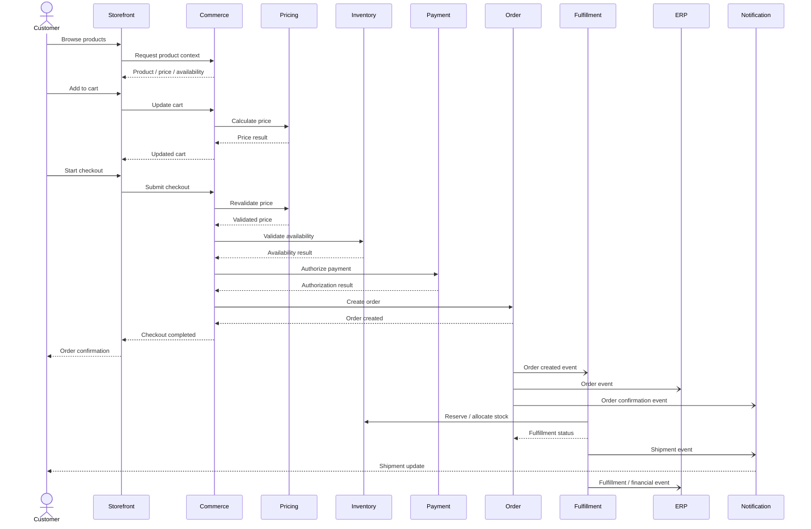

# Order-to-Cash Sequence

## Purpose

The order-to-cash journey connects customer intent with commercial transaction, fulfillment, and financial completion.

This sequence illustrates a generalized enterprise commerce flow and highlights where synchronous validation, asynchronous processing, idempotency, and failure recovery should be considered.

---

## End-to-End Flow



---

## Key Architectural Stages

### 1. Product Discovery

The customer discovers products through search, navigation, recommendations, or other channels.

The response may combine:

- product information
- availability
- pricing
- promotions
- personalization

Not every piece of information needs to originate from the same system.

---

### 2. Cart Creation

The cart represents customer intent rather than a completed transaction.

Typical operations include:

- add item
- remove item
- change quantity
- apply promotion
- calculate totals

Cart operations should remain efficient because they can generate significant traffic.

---

### 3. Checkout Validation

Checkout should assume that previously calculated information may have changed.

Revalidate critical information such as:

- price
- promotion eligibility
- inventory
- customer context
- delivery options
- payment requirements

A cart being valid does not guarantee that checkout remains valid.

---

### 4. Payment Authorization

Payment authorization should be treated as a separate state transition.

Important concerns include:

- idempotency
- timeout handling
- duplicate requests
- unknown outcomes
- authorization versus capture
- reconciliation

A timeout does not necessarily mean that payment failed.

---

### 5. Order Creation

Order creation is the durable commercial transaction.

The order should contain the information required to understand what was purchased at that point in time.

This generally means preserving snapshots of important commercial information such as:

- product information
- quantities
- prices
- discounts
- taxes
- customer context
- delivery information

---

### 6. Downstream Processing

After order creation, downstream processing can often become asynchronous.

Examples:

```text
Order Created
     │
     ├──→ Fulfillment
     ├──→ ERP
     ├──→ Notifications
     ├──→ Analytics
     └──→ Customer Service
```

This reduces unnecessary synchronous coupling.

---

## Failure Scenarios

### Payment Timeout

```text
Payment Request
      ↓
   Timeout
      ↓
Unknown Outcome
      ↓
Do NOT blindly retry
      ↓
Check provider / reconcile
```

### Inventory Failure

If inventory validation fails:

- do not create an invalid order
- return a meaningful checkout error
- preserve customer intent where appropriate

### Downstream ERP Failure

If the order is already committed, an ERP outage should not necessarily make the commerce transaction disappear.

Instead:

```text
Order Created
     ↓
Event Published
     ↓
ERP unavailable
     ↓
Retry / Queue
     ↓
Successful synchronization
```

---

## Idempotency

Operations that may be retried should have clear idempotency semantics.

Examples:

- payment authorization
- order creation
- inventory reservation
- fulfillment commands

A useful model is:

```text
Request
   ↓
Idempotency Key
   ↓
Process
   ↓
Persist Result
   ↓
Retry → Return Existing Result
```

---

## Synchronous vs Asynchronous Decisions

| Interaction | Typical Model | Reason |
|---|---|---|
| Price validation | Synchronous | Required for checkout |
| Inventory validation | Synchronous | Required before commitment |
| Payment authorization | Synchronous / provider-dependent | Transactional decision |
| Order creation | Synchronous | Durable customer transaction |
| ERP notification | Asynchronous | Downstream processing |
| Shipment notification | Asynchronous | Event-driven update |
| Analytics | Asynchronous | Not transaction-critical |
| Customer notification | Asynchronous | Should not block order completion |

The exact model depends on business requirements and consistency expectations.

---

## Architectural Principle

> **Make the customer transaction synchronous only where the business decision requires an immediate answer.**

Everything else should be evaluated for asynchronous processing.

---

## Review Questions

When reviewing an order-to-cash architecture, ask:

- Where is the transaction committed?
- Which system owns the order?
- Which information is revalidated at checkout?
- What happens when payment times out?
- Can order creation be safely retried?
- What happens if ERP is unavailable?
- Are downstream consumers idempotent?
- Which events are emitted?
- Can fulfillment proceed independently?
- Can customer communication fail without affecting the transaction?