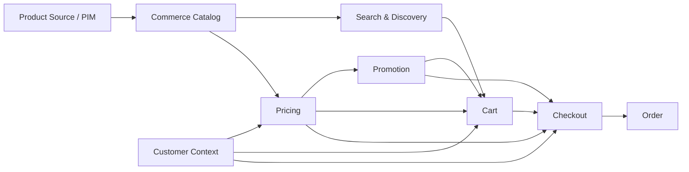

# Product-to-Order Flow

## Purpose

The product-to-order journey demonstrates how product information becomes a commercial transaction.

The key architectural concern is maintaining clear ownership as product data moves through catalog, search, pricing, cart, checkout, and order domains.

---

## End-to-End Flow



---

## Stage 1 — Product Source

Product information may originate from:

- PIM
- ERP
- supplier systems
- merchandising systems
- commerce administration

The source depends on organizational ownership.

The important architectural question is:

> **Which system is authoritative for which product attribute?**

---

## Stage 2 — Commerce Catalog

Commerce may consume and enrich product information required for transactional experiences.

Examples include:

- product relationships
- category assignments
- merchandising attributes
- channel visibility
- sellable status

The commerce catalog should not become an uncontrolled duplicate of every enterprise product attribute.

---

## Stage 3 — Search & Discovery

Search typically optimizes product information for retrieval rather than becoming the authoritative product store.

A common model is:

```text
Authoritative Product Data
          ↓
      Indexing
          ↓
    Search Index
          ↓
Customer Discovery
```

Search data can therefore be rebuilt from its source.

---

## Stage 4 — Customer Context

Product availability and commercial treatment can depend on customer context.

Examples:

- B2C customer
- B2B organization
- customer segment
- market
- currency
- sales channel
- contract

Therefore:

```text
Product
   +
Customer Context
   +
Market Context
       ↓
Commercial Context
```

---

## Stage 5 — Pricing

Pricing determines the applicable commercial price.

Inputs may include:

- product
- customer
- organization
- quantity
- currency
- market
- contract
- price list

Pricing should remain conceptually separate from promotion.

---

## Stage 6 — Promotion

Promotions determine whether an additional commercial benefit applies.

For example:

```text
Base Price
    ↓
Pricing
    ↓
Promotion Eligibility
    ↓
Promotion Benefit
    ↓
Final Commercial Result
```

Separating pricing and promotion makes rules easier to reason about.

---

## Stage 7 — Cart

The cart represents customer intent.

It should retain enough context to reproduce the customer's current commercial calculation while remaining capable of recalculation.

---

## Stage 8 — Checkout

Checkout transforms customer intent into a transaction.

Critical information should be revalidated.

```text
Cart
 ↓
Customer Validation
 ↓
Price Validation
 ↓
Promotion Validation
 ↓
Inventory Validation
 ↓
Delivery Validation
 ↓
Payment
 ↓
Order
```

---

## Stage 9 — Order Snapshot

Once the order is created, it should not depend on future changes to:

- catalog data
- price lists
- promotions
- customer configuration

The order should preserve the commercial facts needed to understand the transaction.

---

## Source-of-Truth Model

| Data | Potential Authority |
|---|---|
| Product master | PIM / ERP |
| Commerce merchandising | Commerce |
| Search index | Search platform |
| Customer identity | Identity / CRM |
| Contractual pricing | Pricing / ERP / Commerce |
| Promotion rules | Commerce / Promotion engine |
| Inventory | Inventory authority |
| Order | Commerce / Order platform |
| Financial transaction | ERP / Finance |
| Shipment status | Fulfillment / Logistics |

The exact ownership model is organization-specific.

---

## Common Failure Modes

### Duplicated Product Ownership

Multiple systems independently modifying the same product attributes.

### Stale Search

Search index not updated reliably after product changes.

### Pricing Drift

Different channels calculating prices differently.

### Promotion Duplication

Promotion rules duplicated across storefront, commerce, and middleware.

### Order Dependency on Live Catalog

Historical orders changing because current catalog information changed.

---

## Architectural Principle

> **Move information between systems deliberately; do not create unnecessary ownership.**

Every replicated data set should have a reason, synchronization strategy, and failure model.