# Enterprise Commerce Reference Architecture

## Purpose

This document presents a generalized reference architecture for an enterprise commerce platform supporting B2B, B2C, and B2B2C business models.

The architecture separates customer experience, commerce capabilities, enterprise integrations, data, and cross-cutting concerns so that each layer can evolve independently.

The objective is not to prescribe a single technology stack, but to provide a reusable architectural baseline for designing scalable, secure, observable, and maintainable commerce platforms.

---

## Reference Architecture

```mermaid
flowchart TB

    subgraph Experience["Experience Layer"]
        Web["Web / Storefront"]
        Mobile["Mobile / PWA"]
        Partner["Partner / Dealer Portal"]
        ServiceUI["Service Experience"]
        External["External Channels"]
    end

    subgraph Access["Experience & API Layer"]
        CDN["CDN / Edge"]
        Gateway["API Gateway"]
        ExperienceAPI["Experience APIs"]
    end

    subgraph Commerce["Commerce Capability Layer"]
        Product["Product & Catalog"]
        Customer["Customer & Organization"]
        Pricing["Pricing"]
        Promotion["Promotion"]
        Cart["Cart"]
        Checkout["Checkout"]
        Order["Order"]
        Inventory["Inventory"]
        Fulfillment["Fulfillment"]
        Returns["Returns"]
        Service["Customer Service"]
    end

    subgraph Integration["Integration & Event Layer"]
        IntegrationLayer["Integration Services"]
        EventBus["Event Backbone"]
        Workflow["Workflow / Process Orchestration"]
    end

    subgraph Enterprise["Enterprise Systems"]
        ERP["ERP / Finance"]
        CRM["CRM / Service"]
        PIM["PIM / Product Data"]
        Payments["Payment Providers"]
        Logistics["Logistics / Fulfillment"]
        ExternalInventory["Inventory Systems"]
        Notifications["Notification Providers"]
    end

    subgraph Platform["Platform & Cross-Cutting"]
        Identity["Identity & Access"]
        Cache["Caching"]
        Search["Search"]
        Data["Operational Data"]
        Observability["Observability"]
        Security["Security Controls"]
    end

    Web --> CDN
    Mobile --> CDN
    Partner --> CDN
    ServiceUI --> CDN
    External --> Gateway

    CDN --> Gateway
    Gateway --> ExperienceAPI

    ExperienceAPI --> Product
    ExperienceAPI --> Customer
    ExperienceAPI --> Pricing
    ExperienceAPI --> Promotion
    ExperienceAPI --> Cart
    ExperienceAPI --> Checkout
    ExperienceAPI --> Order
    ExperienceAPI --> Service

    Checkout --> Payment
    Order --> Inventory
    Order --> Fulfillment
    Fulfillment --> Returns

    Commerce --> IntegrationLayer
    Commerce --> EventBus
    Commerce --> Workflow

    IntegrationLayer --> ERP
    IntegrationLayer --> CRM
    IntegrationLayer --> PIM
    IntegrationLayer --> Payments
    IntegrationLayer --> Logistics
    IntegrationLayer --> ExternalInventory
    EventBus --> Notifications

    Product --> Search
    Product --> Cache
    Pricing --> Cache
    Customer --> Identity

    Commerce --> Data
    Commerce --> Observability
    Commerce --> Security
```



---

## Architectural Layers

### 1. Experience Layer

Responsible for presenting commerce capabilities to different consumers.

Examples include:

* B2C storefronts
* B2B portals
* dealer or partner experiences
* mobile applications
* service experiences
* external channels

The experience layer should not own core commerce business rules.

---

### 2. Experience & API Layer

Provides controlled access to commerce capabilities.

Typical responsibilities include:

* API composition
* authentication context
* request validation
* channel-specific response shaping
* rate limiting
* API versioning
* protocol translation where required

The API layer should avoid becoming a second business-logic layer.

---

### 3. Commerce Capability Layer

Contains the core business capabilities of the commerce platform.

Typical domains include:

| Capability       | Primary Responsibility                              |
| ---------------- | --------------------------------------------------- |
| Product          | Product identity, catalog and merchandising context |
| Customer         | Customer identity and organizational context        |
| Pricing          | Price determination                                 |
| Promotion        | Promotional eligibility and benefits                |
| Cart             | Shopping intent and item management                 |
| Checkout         | Transaction orchestration                           |
| Order            | Durable commercial transaction                      |
| Inventory        | Availability and stock context                      |
| Fulfillment      | Allocation and delivery execution                   |
| Returns          | Return and refund coordination                      |
| Customer Service | Customer and order support                          |

Each domain should have a clearly understood ownership boundary.

---

### 4. Integration & Event Layer

Connects commerce capabilities with external enterprise systems.

Two primary interaction models should be supported:

**Synchronous**

Used when an immediate response is required.

Examples:

* payment authorization
* availability validation
* customer lookup
* real-time pricing

**Asynchronous**

Used when work can continue independently.

Examples:

* order notifications
* fulfillment updates
* search indexing
* analytics events
* downstream synchronization

The integration layer should not become a centralized location for all business logic.

---

### 5. Enterprise Systems

Enterprise commerce rarely operates in isolation.

Typical systems include:

* ERP
* CRM
* PIM
* payment providers
* inventory platforms
* logistics systems
* notification providers

The commerce platform should establish explicit ownership boundaries with these systems.

---

## Ownership Principle

A useful rule is:

> The system that owns a business capability should own its authoritative state and business rules.

For example:

```text
Product data
    ↓
PIM / Commerce ownership boundary

Customer identity
    ↓
Identity / Customer ownership boundary

Payment authorization
    ↓
Payment provider

Order transaction
    ↓
Commerce platform

Financial settlement
    ↓
ERP / Finance
```

The exact ownership model varies by organization, but ambiguity should be avoided.

---

## Data Flow Principle

Not every piece of information needs to be synchronized everywhere.

Prefer:

```text
Source of Truth
       │
       ├── API → Real-time consumer
       │
       └── Event → Interested consumers
```

Avoid:

```text
System A ↔ System B ↔ System C ↔ System D
        ↕       ↕       ↕
      shared assumptions
```

Distributed synchronization without clear ownership creates hidden coupling.

---

## Architectural Boundaries

A healthy commerce architecture generally separates:

```text
Experience
    ↓
API / Access
    ↓
Commerce Capabilities
    ↓
Integration
    ↓
Enterprise Systems
```

Cross-cutting concerns such as:

```text
Security
Observability
Identity
Caching
Search
Data
```

should support these layers without unnecessarily coupling them.

---

## Key Design Principles

### Prefer capability boundaries over technical boundaries

Organize architecture around business capabilities rather than arbitrary technical modules.

### Keep business logic close to its owner

Do not move important business rules into:

* UI layers
* middleware
* integration scripts
* scheduled jobs
* external orchestration systems

unless there is a deliberate architectural reason.

### Minimize synchronous dependencies

Every synchronous dependency can contribute to:

* latency
* availability coupling
* failure propagation
* operational complexity

Use asynchronous processing where immediate consistency is not required.

### Design for failure

Assume:

* external systems will timeout
* APIs will return errors
* events can be duplicated
* downstream systems can become unavailable
* network calls can produce unknown outcomes

Resilience should be designed rather than added later.

### Make observability part of architecture

A production architecture should make it possible to answer:

* What happened?
* Where did it fail?
* How long did it take?
* Which dependency caused the delay?
* Which business transaction was affected?

---

## Architecture Quality Indicators

A strong enterprise commerce architecture should demonstrate:

* clear domain ownership
* explicit integration contracts
* controlled customization
* predictable failure behavior
* measurable performance
* secure access boundaries
* operational observability
* upgradeability
* scalable data access
* appropriate use of synchronous and asynchronous communication

---

## Closing Principle

Enterprise commerce architecture is not primarily about adding more components.

It is about creating **clear boundaries, predictable behavior, and controlled complexity**.

> **Simplicity beats customization.**
