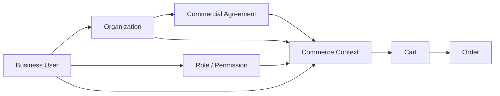

# Case Study: B2B Commerce Transformation

> **Generalized architecture case study — not a representation of any specific client implementation.**

## Scenario

A business operates through organizational customers, partners, dealers, or distributed commercial entities.

Different users may belong to the same organization while having different responsibilities and purchasing permissions.

The platform must support:

- organization-aware customer journeys
- roles and permissions
- contractual pricing
- purchasing policies
- inventory visibility
- order management
- service interactions

---

## Challenge

A B2C-centric commerce model typically assumes:

```text
User
  ↓
Cart
  ↓
Order
```

B2B introduces additional context:

```text
User
  ↓
Organization
  ↓
Role / Permission
  ↓
Contract
  ↓
Commercial Context
  ↓
Transaction
```

Ignoring this context can result in incorrect pricing, authorization, and ownership models.

---

## Context Model



---

## Architectural Approach

### Organization as a First-Class Context

The platform determines which organization the user is acting on behalf of.

### Context-Aware Authorization

Authorization is not limited to:

> "Is this user logged in?"

It may also require:

> "Can this user perform this action for this organization?"

### Contractual Pricing

Pricing can depend on:

- organization
- agreement
- product
- quantity
- market
- currency

### Purchase Controls

The architecture may support:

- spending limits
- approval workflows
- restricted products
- role-based purchasing
- order visibility rules

---

## Order Ownership

An order should preserve sufficient context to determine:

- purchasing organization
- acting user
- commercial terms
- delivery context
- applicable pricing

This is particularly important when organizational configuration changes later.

---

## Integration Considerations

B2B commerce commonly integrates with enterprise systems responsible for:

- customer master data
- financial information
- contractual pricing
- inventory
- order processing
- service management

Integration boundaries should be explicit rather than allowing every system to modify the same business state.

---

## Key Trade-offs

| Decision | Consideration |
|---|---|
| Centralized organization model | Consistency vs flexibility |
| Real-time customer validation | Accuracy vs latency |
| Contract pricing lookup | Freshness vs availability |
| Approval workflow | Control vs checkout simplicity |
| Shared B2B/B2C platform | Reuse vs domain complexity |

---

## Lessons

1. B2B commerce is primarily about context and relationships.
2. Authentication is not sufficient for B2B authorization.
3. Organization ownership should be explicit.
4. Contractual pricing needs clear ownership.
5. Transaction history should preserve commercial context.
6. B2B complexity should not automatically be solved through platform customization.

---

## Confidentiality Note

This case study is a generalized conceptual scenario created for public architectural discussion.