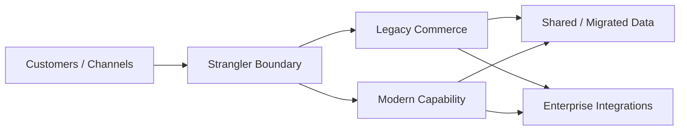

# Case Study: Modernizing an Enterprise Commerce Platform

> **Generalized architecture case study — not a representation of any specific client implementation.**

## Scenario

An established commerce platform has accumulated:

- legacy storefront technology
- tightly coupled integrations
- custom business logic
- aging APIs
- database performance issues
- technical debt

The business wants modernization without disrupting ongoing commerce operations.

---

## Challenge

A complete replacement may create significant:

- migration risk
- business disruption
- data migration complexity
- integration effort
- delivery time

A better approach may be incremental modernization where appropriate.

---

## Modernization Model



---

## Assessment

Before choosing a modernization strategy, assess:

### Business Criticality

Which capabilities are most important?

### Technical Risk

Which components create the highest operational risk?

### Change Frequency

Which areas change frequently?

### Performance

Where are measurable bottlenecks?

### Integration Coupling

Which dependencies prevent independent change?

### Customization

Which customizations are genuinely required?

---

## Modernization Options

| Strategy | Description |
|---|---|
| Rehost | Move with minimal architectural change |
| Replatform | Change the underlying platform/runtime |
| Refactor | Improve implementation without changing capability ownership |
| Rearchitect | Change architectural boundaries |
| Replace | Introduce a new capability/platform |

The appropriate strategy depends on the problem being solved.

---

## Strangler Approach

A gradual approach can look like:

```text
Phase 1
Legacy owns everything

Phase 2
Legacy + new capability

Phase 3
New capability expands

Phase 4
Legacy responsibility decreases

Phase 5
Legacy capability retired
```

This reduces the need for a single high-risk migration event.

---

## Anti-Corruption Layer

When legacy models differ significantly from modern models, an anti-corruption layer can isolate those differences.

```text
Modern Domain
     ↓
Anti-Corruption Layer
     ↓
Legacy Domain
```

This prevents legacy concepts from spreading throughout the modern architecture.

---

## Migration Principles

### Migrate incrementally

Avoid unnecessary big-bang migrations.

### Preserve business continuity

Customer-facing commerce should remain operational.

### Measure each phase

Examples:

- latency
- error rate
- deployment frequency
- operational incidents
- conversion-related business metrics
- infrastructure cost

### Retire old paths

Modernization fails when the old architecture remains permanently active.

---

## Key Trade-offs

| Approach | Benefit | Risk |
|---|---|---|
| Big-bang replacement | Clean end state | High migration risk |
| Incremental modernization | Lower change risk | Longer transition |
| Shared legacy/new data | Easier transition | Coupling |
| Isolated new capability | Cleaner boundary | Integration effort |
| Compatibility layer | Controlled migration | Additional component |

---

## Lessons

1. Modernization should solve measurable problems.
2. Not every legacy component needs immediate replacement.
3. Migration architecture is as important as target architecture.
4. Temporary compatibility mechanisms need an exit strategy.
5. Technical debt should be prioritized rather than treated equally.
6. A modernization program should have explicit retirement milestones.

---

## Confidentiality Note

This case study is a generalized modernization scenario and does not describe a specific client environment.