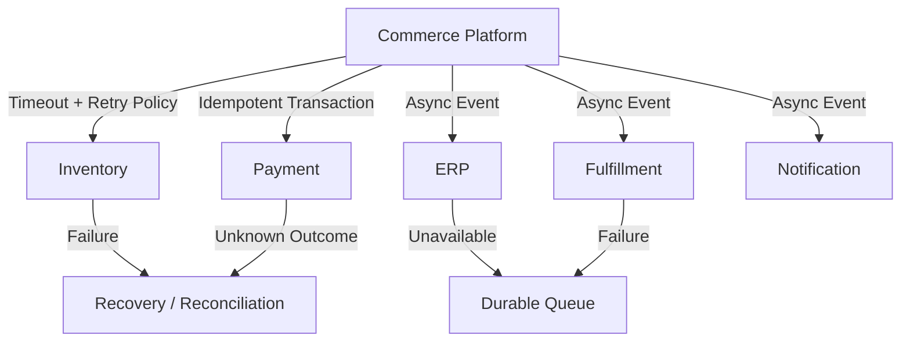

# Case Study: Building Resilient Commerce Integrations

> **Generalized architecture case study — not a representation of any specific client implementation.**

## Scenario

A commerce platform depends on multiple external systems for:

- inventory
- payment
- customer data
- order processing
- fulfillment
- notifications

Each dependency introduces potential latency and failure.

---

## Challenge

A naïve architecture may look like:

```text
Checkout
   ↓
Inventory
   ↓
Pricing
   ↓
Payment
   ↓
ERP
   ↓
Notification
```

If every dependency is synchronous, one downstream failure can propagate through the entire customer journey.

---

## Resilience Architecture



---

## Failure Classification

Not every failure should be retried.

### Transient

Examples:

- temporary network issue
- rate limiting
- temporary service unavailability

Potential response:

```text
Retry + Backoff
```

### Permanent

Examples:

- invalid request
- authorization failure
- business validation error

Potential response:

```text
Do Not Retry
Return / Record Error
```

### Unknown

Examples:

- payment timeout
- connection lost after request submission

Potential response:

```text
Reconcile Before Retrying
```

---

## Idempotency

Consider:

```text
Create Order
      ↓
Request reaches server
      ↓
Response is lost
      ↓
Client retries
```

Without idempotency:

```text
Order A
Order B
```

With idempotency:

```text
Request Key
     ↓
Existing Result
     ↓
Same Transaction
```

---

## Timeouts

Every external dependency should have an intentional timeout.

An unlimited wait can consume:

- application threads
- connection pools
- request capacity
- customer patience

Timeouts should be based on actual dependency characteristics and business requirements.

---

## Circuit Breaking

Repeated failures can justify temporarily stopping calls to an unhealthy dependency.

```text
Healthy
   ↓
Failures increase
   ↓
Circuit Open
   ↓
Dependency protected
   ↓
Recovery detection
   ↓
Circuit Closed
```

Circuit breakers should be used deliberately rather than as a substitute for proper failure design.

---

## Graceful Degradation

Some commerce experiences can continue with reduced functionality.

Examples:

```text
Recommendation unavailable
        ↓
Show standard product experience
```

or:

```text
Analytics unavailable
        ↓
Commerce transaction continues
```

Not every dependency should be allowed to block the core transaction.

---

## Recovery

A resilient architecture needs recovery mechanisms.

Examples:

- retry queues
- dead-letter queues
- reconciliation jobs
- operational dashboards
- manual recovery procedures
- compensating actions

---

## Observability

Track:

- dependency latency
- timeout rate
- retry count
- failure rate
- queue depth
- reconciliation backlog
- circuit state
- business transaction failures

Technical monitoring alone is insufficient.

---

## Key Trade-offs

| Strategy | Benefit | Cost |
|---|---|---|
| Retry | Recovers transient failures | Can amplify load |
| Timeout | Prevents indefinite blocking | May terminate slow valid requests |
| Circuit breaker | Prevents cascading failure | Adds state/complexity |
| Async processing | Reduces coupling | Eventual consistency |
| Reconciliation | Handles unknown outcomes | Operational complexity |
| Graceful degradation | Protects core journey | Reduced functionality |

---

## Lessons

1. External dependencies should be assumed unreliable.
2. Retry without idempotency can be dangerous.
3. Unknown outcomes require reconciliation.
4. Not every dependency belongs in the synchronous customer path.
5. Resilience includes recovery, not only failure prevention.
6. Business-critical transactions should be protected from non-critical dependencies.

---

## Confidentiality Note

This is an independently generalized resilience architecture case study.