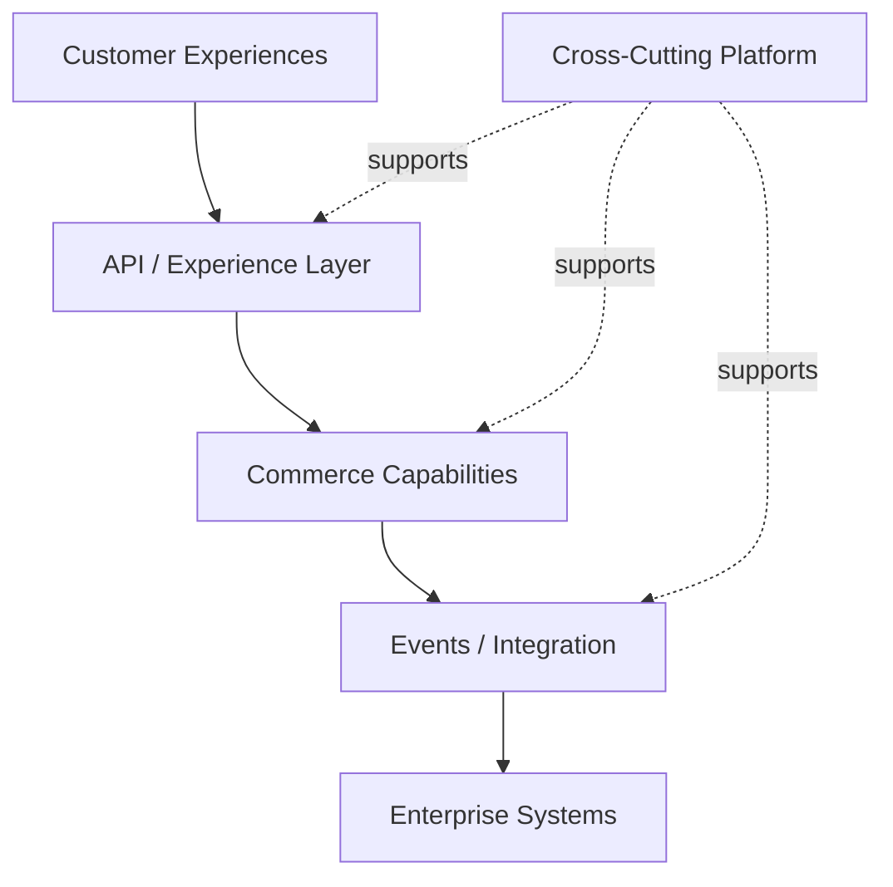

# Case Study: Designing a Scalable Enterprise Commerce Platform

> **Generalized architecture case study — not a representation of any specific client implementation.**

## Scenario

An enterprise is building a commerce platform expected to support multiple channels, growing product volume, increasing customer traffic, and integration with several enterprise systems.

The platform must support:

* product discovery
* customer accounts
* pricing
* promotions
* cart and checkout
* order management
* inventory
* fulfillment
* customer service

The architecture must remain maintainable as the business expands.

---

## Challenge

A traditional implementation can gradually become tightly coupled:

```text
Storefront
   ↓
Commerce Application
   ↓
Everything
   ↓
ERP / CRM / Inventory / Payment
```

As traffic and business complexity increase, this can result in:

* slow transactions
* tightly coupled integrations
* difficult releases
* database bottlenecks
* excessive customization
* fragile downstream dependencies

---

## Architectural Approach

The solution is organized around business capabilities.



---

## Key Design Decisions

### Capability-Oriented Design

Commerce capabilities have clear ownership.

### API-First Experience

Customer experiences consume defined commerce APIs.

### Asynchronous Downstream Processing

Non-critical downstream work is decoupled using events.

### Caching

Frequently accessed, relatively stable information is cached deliberately.

### Database Discipline

High-volume access paths are reviewed for:

* indexing
* query efficiency
* data access patterns
* unnecessary joins
* excessive reads

### Observability

The platform exposes:

* latency
* error rate
* throughput
* dependency health
* business transaction visibility

---

## Scaling Strategy

Scaling is considered across multiple dimensions:

```text
Traffic
Data Volume
Search Volume
Background Processing
Integration Load
```

Rather than scaling the entire platform blindly, individual bottlenecks are identified and addressed.

---

## Example Flow

```text
Customer
   ↓
Experience
   ↓
API
   ↓
Commerce Capability
   ├── Cache
   ├── Database
   └── Search
   ↓
Business Event
   ├── ERP
   ├── Fulfillment
   └── Notifications
```

---

## Trade-offs

| Decision                    | Benefit                 | Trade-off               |
| --------------------------- | ----------------------- | ----------------------- |
| Async downstream processing | Lower coupling          | Eventual consistency    |
| Caching                     | Lower latency           | Invalidation complexity |
| Domain boundaries           | Better ownership        | More design discipline  |
| API abstraction             | Experience independence | Additional API layer    |
| Event-driven integration    | Decoupling              | Operational complexity  |

---

## What This Architecture Optimizes For

* predictable performance
* controlled complexity
* independent evolution
* operational visibility
* resilience
* upgradeability

It does not attempt to eliminate every synchronous interaction or introduce distributed components purely for architectural fashion.

---

## Lessons

1. Scale should be designed around actual bottlenecks.
2. Domain boundaries matter more than component count.
3. Asynchronous processing should have a business reason.
4. Database design is part of architecture.
5. Observability should be designed from the beginning.
6. Simplicity remains a scalability strategy.

---

## Confidentiality Note

This case study is an independently generalized architecture scenario. It contains no client source code, client data, proprietary configuration, confidential implementation details, or production architecture.
